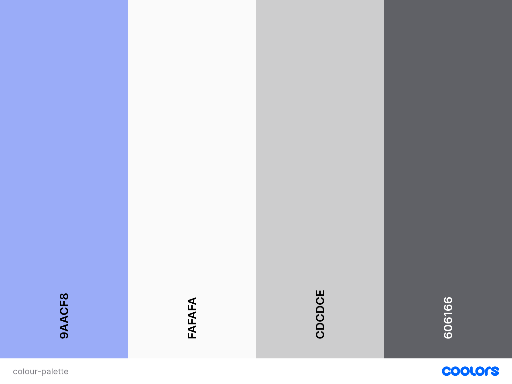
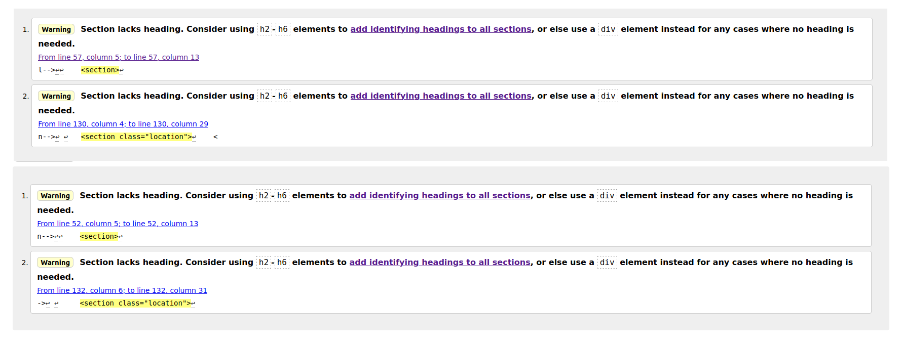
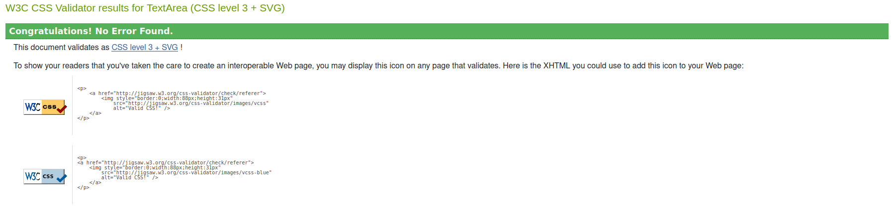

# UrszUla Photography

## Code Institute - Milestone Project 1

UrszUla Photography is a website made for a photographer who is trying to grow her business. 

[See live website](https://annasedab.github.io/UrszUla-Photography/)

---
## Project goals
 
- Encouraging users to book a photo session with the photographer
- Presenting abilities of the photographer
- Showing how professional and at the same time approachable the photographer is
- Presenting the most popular packages and prices to give an idea of the options
- Pointing out how the service can be given as a present
- Providing testimonials of happy customers
 
---
 
## User Stories
 
- I want to see the photographer's work
- I want to know what other people say about photographer
- I want to ask questions about services
- I want to know how much services cost
- I want to have my portrait taken
- I want to have photographs of my newborn baby taken
- I want to gift a photo session as a present to someone else
- I want to have old black and white pictures restored
- I want to know about photographer’s skills
- I want to know where the photo studio is located
 
---

## Design
 
The most important factor in creating and designing website was showcasing the abilities of the photographer. Each page contains pictures that are meant to inspire potential clients to book a photo session.
 
### Colour Scheme
 
Colour palette is toned down with very light background and grey elements not to clash with colours of the photographs. The only other colour introduced is blue #9aacf8 which is used in the logo designed by the photographer. The same colour is also used on social media icons upon hoover action. 

 
### Typography
 
The font used for most of the text including the headers is BenchNine.
The font used in the contact section Great vibes is meant to give a bit of artistic feel to the website.
Both are imported from Google fonts using a link placed in the head of each html page.
 
### Images
 
All used images are intellectual property of UrszUla photographer. Full permission was given to use them for the purposes of the Milestone Project 1. 
 
### Icons
 
Icons used in the footer of the website were imported from Font Awesome using a link placed in the head of each html page.

---
 
## Wireframes
 
The website was designed simultaneously for desktop and mobile devices. Wireframes were creatied using Canva online graphic design tool. During the creation some of the features and their placement was adjusted to make website more transparent. For example testimonials in the mobile device version were ment to be placed on the pictures, however, as there was not enough space to do that decision was made to move them below corresponding pictures.
 
### Desktop
 

 
### Mobile
 

 
---

## Features

### Features present on all pages
 
- Navigation bar
Main navigation bar is visible on all of the pages and is glued to the top. It was created using Bootstrap Framework. Links collapse on the smaller screen sizes into a 'hamburger menu'.
 
It contains the logo of the photographer and the menu links. Links under ‘Gallery’, ‘About’ and ‘Packages’ take the user to the respective pages. Clicking on 'Contact us' takes the user to the contact form at the bottom of the page.
 
- Contact form
To make it easy for the user to contact the photographer the form is present at the bottom of each page. Also the 'Contact us' link in the navigation bar takes the user to the bottom of the page.
 
- Footer
Contains links to the facebook and instagram pages which upon clicking open on new pages. Icons are imported from Font Awesome. Colours showing upon hover action match the colour introduced in the logo
 
- Location
 
Location of the photographer is added below the contact form. It serves two purposes:
1) It answers potential questions the user might have regarding the location.
2) It pushes the contact form towards the centre of the page when the user clicks ‘Contact us’ from the navigation bar.
 
### Features on index.html

- Carousel

Carousel was created using Bootstrap Framework. It is the first thing that the user will see when entering the website and is showing off the skills of the photographer.

- Introduction

First block of text that te user will see introducing the photograpgher. 

- Testimonials
 
Testimonials chosen for the page highlight the skills of the photographer. Baby session testimonial also points out it can be booked as a gift.

### Features on contact-submission.html - Thank you page

It's a simple page showing upon completing the contact form.
Page contains navigation and footer so it is possible to go back to whatever part of the website without needing to use the browsers/mobile devices navigation.

### Features on gallery.html

- Gallery navigation
 
Gallery navigation is glued underneath the main navigation to make it easy to jump between sections which is especially useful for the mobile device users.
- Gallery
 
Gallery is created using flex-box. It shows pictures from the photo sessions and before & after of the restored old photographs.

### Features on packages.html
 
- Packages
 
Flexbox contains pricing and the description of the most popular packages and an example picture. Description suggests modifications that might be added to the package and encourages to contact the photographer.

### Features on about.html

- About photographer
 
Flexbox containing a picture of the photographer and info about them.
- Photoshop skills
Flexbox containing description and example of the photographer's photoshop skills.
 
---
 
## Languages used
 
- HTML
- CSS
- MARKDOWN
- JavaScript (imported form Bootstrap Framework)

---

## Resources used
 
- Bootstrap Framework v4.5 - used to add carousel, navigation bar, flexbox on the index.html page
- Font awesome - importing facebook and instagram icons used
- Google fonts - importing fonts used on the website
- W3Schools - used to find solutions to problems with code
- Firefox developer tools - checking responsiveness and observing effect of code changes in real time
- Slack - used to find the solutions for the encountered problems with code, Github and Gitpod services
- Canva - used for creating wireframes
- Github - used as a repository and to host the deployed website
- Gitpod - used to build and develop the website
- Code Institute - used to review concepts covered in the course
- Lighthouse - used to check responsiveness of the website
- W3C CSS Validation Service - used to validate the CSS file
- W3C HTML Validation Service - used to validate the HTML files
- CodeBeautify - used to beautify CSS and HTML code
- Coolor - used to create colour palette
- Am I responsive - used to create mock up image of ho the website will look on different screen sizes

---

## Testing

### Lighthouse

### HTML Validatior

HTML validator suggested adding heading to the carousel(index.html), gallery navigation(gallery.html) and location(all pages). I ecided it would not be beneficial to the website to do so.

### CSS Validator

CSS code was validated without problems.

### Manual tests
 
Throughout creation the website was tested for its responsivenes.
 
Upon completing website was tested on following browsers and devices:
 
- Desktop browsers:
   - Firefox
   - Chromium
   - Chrome
- Mobile devices:
   - Galaxy S7
   - Huawei ELE-L29

also in Firefox developer tools on different screen sizes.
 
Testing included resizing of the screen, scrolling, clicking on links and buttons, hovering over links, submitting the form, making sure links open in new pages.

---

## Fixed bugs

Scrollbar in Chromium causing page to overflow. - Added code to the body element:

    max-width: 100%;
    overflow-x: hidden;
    overflow-y: scroll;

Gallery navigation scrolling over contact form section. - Gave z-index property to the relevant elements.

---
 
## Unfixed bugs
 
On smaller screens 'hamburger menu' does not fold back after clicking 'Get in touch'. From wahat I understand the solution requires Java script and it will be something I am plannin on solving in the near future when I start learning Java script.

Contact form options font is not affected by the formating in Firefox browser.

---

## Responsiveness

Website was developed simultaneously for mobile and desktop view. Media queries were used to adjust content to every other resolution. Use of flexboxes allows the content to shift, stretch and move depending on the screen size.

---

## Deployment

- Logg to the Github website
- Select **UrszUlaPhotography** repository
- Select **Settings** from the navigation bar
- Select **Pages** from the menu on the left
- Pick source **Deploy from branch**
- Pick branch **main**
- Click save button
- Link to the website appeares at the top of the page

---

## Cloning the Github repository

- Logg in to the Github
- Select **UrszUlaPhotography** repository
- Click on the **Code** button located next to the green Gitpod button
- Copy link form the HTTPS section
- Open terminal
- Change the current working directory to the location where you want the cloned directory
- Type "git clone" and the previously copier URL
- Press **Enter** 

---

## Forking the Github repository

- Logg in to the Github
- Select repository you want to fork
- Click on the **Fork** button located on the right top section of the page
- The copy of oryginal repository is made into your Github account

---

## Credits

With exeption of the code pulled from Bootstrap Framework all content was written by me.

---

## Acknowledgements

Huge thank you to my mentor Mitko Bachvarov for guiding me through the project and the photographer Urszula for providing me with all the images and feedback on the website design.
